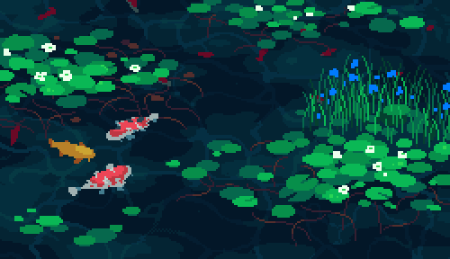

<!--  -->
<h1 align="center">Hi 👋, I'm Mohammad Yehya</h1>

- 🤖 I have a mild obsession with System Design and AI. If there's a new tech out there, I’m probably already trying to break it or make it better.
- 🚀 Future Goals:
  - 🧠 Develop Generative AI-based Saas (because why not let AI do all the work?)
  - 🎮 Create an open-source game engine (because reinventing the wheel is my idea of fun).
  - ⚡ Learn Rust to make things blazingly fast and unreasonably secure.
- 🖥️ I use Arch btw! mostly so I can fix problems I never had in the first place...

  <!--  -->
  

<!--   -->

 
  
    
  
  

<!-- https://emigonetworks.com/certification-training/microsoft-certifications/azure-certification-training/azure-900-certification-training for certification svgs-->
<h2 align="center">Certifications</h2>

&nbsp;
  
  
  

<!-- 
&nbsp;
  

&nbsp;
  
  

 -->

<h2 align="center">GitHub Stats</h2>

&nbsp;
  
  

<h2 align="center">Tech Stack</h2>

Skilled in building intelligent systems using agentic AI frameworks like LangGraph and CrewAI, RAG pipelines, and modern LLM stacks. Experienced with real-time and distributed architectures, serverless design, and integrating AI into scalable cloud-native backends using tools like Kafka and FastAPI. Comfortable working across APIs, vector search, orchestration tools, and multi-agent workflows.

For full list of skills, check out <a href="https://mohammadyehya.github.io/Skills">my portfolio</a>.

<h2 align="center">Latest Repos Worked On</h2>

(Automatically Updates via Github Actions)

<!-- LAST_WORKED_ON_REPOS -->

<!-- END_LAST_WORKED_ON_REPOS -->

