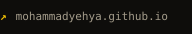
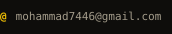
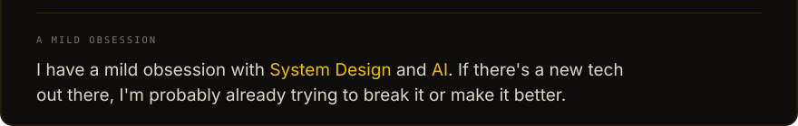
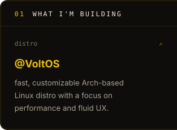
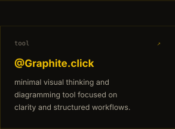
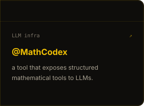
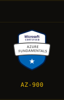
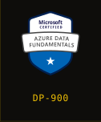
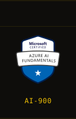

<a href="https://mohammadyehya.github.io"></a><a href="mailto:mohammad7446@gmail.com"></a>

<a href="https://github.com/volt-os"></a><a href="https://github.com/Graphite-click"></a><a href="https://github.com/MohammadYehya/MathCodex"></a>

  

<a href="https://learn.microsoft.com/api/credentials/share/en-us/MohammadYehya/35D9770C7FF71E2?sharingId=31B8B51663DCA340"></a><a href="https://learn.microsoft.com/api/credentials/share/en-us/MohammadYehya/D777DC1275EEBC67?sharingId=31B8B51663DCA340"></a><a href="https://learn.microsoft.com/api/credentials/share/en-us/MohammadYehya/4D41A80F9460F08D?sharingId=31B8B51663DCA340"></a><a href="https://learn.microsoft.com/api/credentials/share/en-us/MohammadYehya/57B97DDDBDD0B602?sharingId=31B8B51663DCA340"></a><a href="https://learn.microsoft.com/api/credentials/share/en-us/MohammadYehya/5290D9046C16C22?sharingId=31B8B51663DCA340"></a><a href="https://learn.microsoft.com/api/credentials/share/en-us/MohammadYehya/9828F17DF3767535?sharingId=31B8B51663DCA340"></a><a href="https://learn.microsoft.com/api/credentials/share/en-us/MohammadYehya/E7BC828CACB72A8F?sharingId=31B8B51663DCA340"></a>

