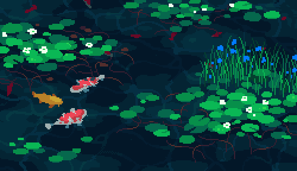

<!-- Animated pixel koi pond — live GitHub stats on lily pads. Auto-updates daily via .github/workflows/pixel-pond.yml. Source & docs: /pixel-pond -->
<!-- 

  

 -->

<samp>

### Hey!

→ I'm **Mohammad Yehya**.

→ An open-source developer with a mild obsession for system design and AI.

→ I build **[<mark>@VoltOS</mark>](https://github.com/volt-os)**, a fast, fluid Arch-based distro
<!-- **[<mark>@Graphite.click</mark>](https://github.com/Graphite-click)**, a minimal diagramming tool\
**[<mark>@MathCodex</mark>](https://github.com/MohammadYehya/MathCodex)**, structured math for LLMs-->

 
 

<!-- https://emigonetworks.com/certification-training/microsoft-certifications/azure-certification-training/azure-900-certification-training for certification svgs-->
<h3 align="center">Certifications</h3>

&nbsp;
  
  
  
  
  
  <!--  -->
  
  
  <!--  -->
  <!--  -->

<h2 align="center">GitHub Stats</h2>

&nbsp;
  
  

<h2 align="center">Latest Repos Worked On</h2>

(Automatically Updates via Github Actions)

<!-- LAST_WORKED_ON_REPOS -->

<!-- END_LAST_WORKED_ON_REPOS -->

