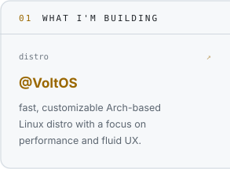
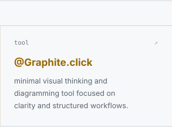
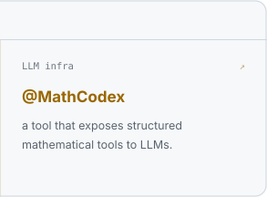
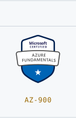
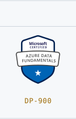
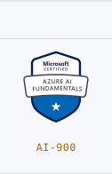

<picture><source media="(prefers-color-scheme: dark)" srcset="./.gitassets/dark/head.svg"><source media="(prefers-color-scheme: light)" srcset="./.gitassets/light/head.svg"></picture>

<a href="https://github.com/volt-os"><picture><source media="(prefers-color-scheme: dark)" srcset="./.gitassets/dark/card-voltos.svg"><source media="(prefers-color-scheme: light)" srcset="./.gitassets/light/card-voltos.svg"></picture></a><a href="https://github.com/Graphite-click"><picture><source media="(prefers-color-scheme: dark)" srcset="./.gitassets/dark/card-graphite.svg"><source media="(prefers-color-scheme: light)" srcset="./.gitassets/light/card-graphite.svg"></picture></a><a href="https://github.com/MohammadYehya/MathCodex"><picture><source media="(prefers-color-scheme: dark)" srcset="./.gitassets/dark/card-mathcodex.svg"><source media="(prefers-color-scheme: light)" srcset="./.gitassets/light/card-mathcodex.svg"></picture></a>

<a href="https://mohammadyehya.github.io/Skills"><picture><source media="(prefers-color-scheme: dark)" srcset="./.gitassets/dark/stack.svg"><source media="(prefers-color-scheme: light)" srcset="./.gitassets/light/stack.svg"></picture></a>

<a href="https://learn.microsoft.com/api/credentials/share/en-us/MohammadYehya/35D9770C7FF71E2?sharingId=31B8B51663DCA340"><picture><source media="(prefers-color-scheme: dark)" srcset="./.gitassets/dark/certifications/cert-gh-900.svg"><source media="(prefers-color-scheme: light)" srcset="./.gitassets/light/certifications/cert-gh-900.svg"></picture></a><a href="https://learn.microsoft.com/api/credentials/share/en-us/MohammadYehya/D777DC1275EEBC67?sharingId=31B8B51663DCA340"><picture><source media="(prefers-color-scheme: dark)" srcset="./.gitassets/dark/certifications/cert-gh-200.svg"><source media="(prefers-color-scheme: light)" srcset="./.gitassets/light/certifications/cert-gh-200.svg"></picture></a><a href="https://learn.microsoft.com/api/credentials/share/en-us/MohammadYehya/4D41A80F9460F08D?sharingId=31B8B51663DCA340"><picture><source media="(prefers-color-scheme: dark)" srcset="./.gitassets/dark/certifications/cert-az-900.svg"><source media="(prefers-color-scheme: light)" srcset="./.gitassets/light/certifications/cert-az-900.svg"></picture></a><a href="https://learn.microsoft.com/api/credentials/share/en-us/MohammadYehya/57B97DDDBDD0B602?sharingId=31B8B51663DCA340"><picture><source media="(prefers-color-scheme: dark)" srcset="./.gitassets/dark/certifications/cert-dp-900.svg"><source media="(prefers-color-scheme: light)" srcset="./.gitassets/light/certifications/cert-dp-900.svg"></picture></a><a href="https://learn.microsoft.com/api/credentials/share/en-us/MohammadYehya/5290D9046C16C22?sharingId=31B8B51663DCA340"><picture><source media="(prefers-color-scheme: dark)" srcset="./.gitassets/dark/certifications/cert-ai-900.svg"><source media="(prefers-color-scheme: light)" srcset="./.gitassets/light/certifications/cert-ai-900.svg"></picture></a><a href="https://learn.microsoft.com/api/credentials/share/en-us/MohammadYehya/9828F17DF3767535?sharingId=31B8B51663DCA340"><picture><source media="(prefers-color-scheme: dark)" srcset="./.gitassets/dark/certifications/cert-ab-730.svg"><source media="(prefers-color-scheme: light)" srcset="./.gitassets/light/certifications/cert-ab-730.svg"></picture></a><a href="https://learn.microsoft.com/api/credentials/share/en-us/MohammadYehya/E7BC828CACB72A8F?sharingId=31B8B51663DCA340"><picture><source media="(prefers-color-scheme: dark)" srcset="./.gitassets/dark/certifications/cert-ab-731.svg"><source media="(prefers-color-scheme: light)" srcset="./.gitassets/light/certifications/cert-ab-731.svg"></picture></a>

